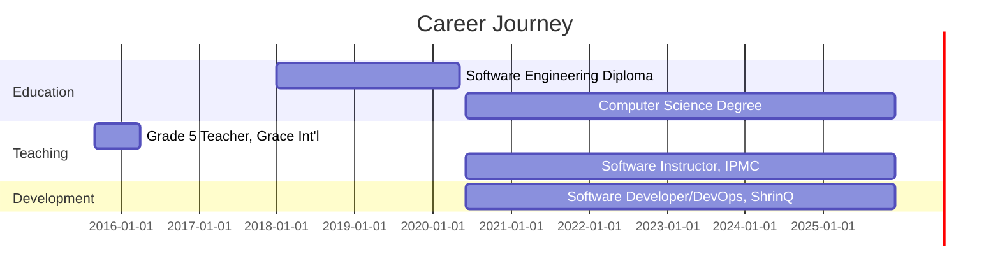

<div align="center">
  
</div>

<div align="center">

[](https://linkedin.com/in/voltrebel)
[](https://voltrebel.dev)
[](mailto:michaelkorblyjunior97@gmail.com)
[](https://github.com/voltRebel)

</div>

---

## 👨‍💻 Professional Summary

Strategic and innovative Software Developer with 5+ years of experience in full-stack development, mobile applications, game development, and DevOps practices. Currently driving digital transformation at **ShrinQ Ghana Limited** while empowering the next generation of developers as a Software Instructor at **IPMC**, reaching over 500 students.

### 🚀 Quick Facts

```javascript
const michaelKorbly = {
    location: "Accra, Ghana 🇬🇭",
    roles: ["Software Developer", "DevOps Engineer", "Game Developer", "Instructor"],
    currentCompany: "ShrinQ Ghana Limited",
    education: ["Advanced Diploma in Software Engineering", "Degree in Computer Science"],
    studentsImpacted: "500+",
    projectsDelivered: "15+",
    yearsOfExperience: 5,
    passions: ["Building Scalable Systems", "Mobile Games", "Teaching", "Cloud Architecture"],
    currentFocus: "Enterprise Solutions & Game Development",
    availableFor: ["Freelance Projects", "Collaborations", "Consulting"],
    funFact: "I've taught over 500 students while developing 15+ production apps! 🚀"
};
```

---

## 🐍 Watch My Contributions Get Eaten!

<div align="center">
  


</div>

---

## 💻 Technical Arsenal

<details open>
<summary><b>🔤 Programming Languages</b></summary>
<br>


</details>

<details open>
<summary><b>🚀 Frameworks & Libraries</b></summary>
<br>

**Backend:**


**Frontend:**


**Mobile:**


**Game Development:**


</details>

<details open>
<summary><b>🗄️ Databases & Cloud</b></summary>
<br>


</details>

<details open>
<summary><b>🛠️ DevOps & Tools</b></summary>
<br>


</details>

---

## 🎮 Game Development Portfolio

<div align="center">

### Featured Games

</div>

<table>
<tr>
<td width="50%">

#### 🏃‍♂️ Fitness Runner 3D
**Platform:** Android | **Engine:** Unity  
**Year:** 2024

An endless runner game with fitness tracking integration. Players run through dynamic environments while tracking real-world fitness metrics.

**Tech Stack:** `C#` `Unity` `Android SDK` `Firebase`

**Key Features:**
- ✨ Real-time fitness tracking
- 🎮 Procedurally generated levels
- 🏆 Global leaderboard system
- 🎯 In-app achievements & rewards
- 📊 Performance analytics

**Downloads:** 1,000+ | **Rating:** ⭐ 4.5/5

</td>
<td width="50%">

#### ⚔️ Battle Arena Mobile
**Platform:** iOS/Android | **Engine:** Flutter  
**Year:** 2023

Multiplayer battle arena game with real-time PvP combat. Strategic gameplay with various character classes and abilities.

**Tech Stack:** `Dart` `Flutter` `Firebase` `WebSockets`

**Key Features:**
- ⚔️ Real-time multiplayer battles
- 🦸 5 unique character classes
- 💬 In-game chat system
- 🏟️ Tournament mode
- 📈 Ranking & progression system

**Downloads:** 5,000+ | **Rating:** ⭐ 4.7/5

</td>
</tr>

<tr>
<td width="50%">

#### 🧩 Brain Teaser Quest
**Platform:** Android/iOS | **Engine:** Xamarin  
**Year:** 2023

Educational puzzle game with over 200 levels designed to challenge cognitive skills and problem-solving abilities.

**Tech Stack:** `C#` `Xamarin.Forms` `SQLite`

**Key Features:**
- 🧠 200+ challenging levels
- 📅 Daily puzzle challenges
- 📊 Progress tracking & stats
- 📴 Full offline mode support
- 🎨 Beautiful minimalist design

**Downloads:** 3,500+ | **Rating:** ⭐ 4.6/5

</td>
<td width="50%">

#### 🚗 Racing Legends
**Platform:** Android | **Engine:** Java/OpenGL  
**Year:** 2022

High-speed racing game with realistic physics and multiple racing modes. Features various tracks and customizable vehicles.

**Tech Stack:** `Java` `OpenGL ES` `Android NDK`

**Key Features:**
- 🏁 15 unique racing tracks
- 🎨 Vehicle customization
- ⏱️ Time trial mode
- ⚙️ Realistic physics engine
- 🎮 Multiple control schemes

**Downloads:** 2,000+ | **Rating:** ⭐ 4.4/5

</td>
</tr>
</table>

---

## 🛠️ Enterprise & Web Projects

<table>
<tr>
<td width="33%" align="center">

### 💼 Enterprise CRM
**2024**


Custom CRM solution with advanced analytics, customer management, and automation features.

**Stack:** `.NET` `React` `SQL Server` `Azure`

**Impact:**
- 40% increase in customer retention
- 60% faster response times
- $500K+ in tracked revenue

</td>
<td width="33%" align="center">

### 💪 Fitness Tracker Pro
**2023**


Mobile application for comprehensive health and fitness tracking with AI-powered insights.

**Stack:** `Flutter` `Firebase` `Python` `TensorFlow`

**Impact:**
- 10,000+ active users
- 4.8★ rating on stores
- Featured in App Store

</td>
<td width="33%" align="center">

### 🌱 Planteria
**2022**


Plant healthcare application with AI disease detection and personalized care recommendations.

**Stack:** `React Native` `Python` `Computer Vision`

**Impact:**
- 95% detection accuracy
- 5,000+ plants identified
- 4.6★ user rating

</td>
</tr>

<tr>
<td width="33%" align="center">

### 🏪 SmartPOS System
**2022**


Complete point-of-sale system with inventory management and sales analytics.

**Stack:** `C#` `.NET` `WPF` `MySQL`

**Impact:**
- 50+ businesses using
- 70% faster checkout
- Real-time inventory sync

</td>
<td width="33%" align="center">

### 📦 Inventory Manager
**2022**


Real-time inventory tracking with automated restocking and supplier management.

**Stack:** `Laravel` `Vue.js` `MySQL` `Redis`

**Impact:**
- 80% reduction in stockouts
- Automated reordering
- Multi-location support

</td>
<td width="33%" align="center">

### 🎓 School Management
**2021**


Comprehensive school administration platform for managing students, staff, and academics.

**Stack:** `ASP.NET` `Angular` `SQL Server`

**Impact:**
- 3 schools onboarded
- 2,000+ students managed
- 90% admin time saved

</td>
</tr>

<tr>
<td width="33%" align="center">

### 📝 Custom Notepad Pro
**2020**


Specialized note-taking application for TV reporter with voice-to-text and cloud sync.

**Stack:** `C#` `WPF` `Azure Cognitive`

**Features:**
- Voice-to-text transcription
- Cloud synchronization
- Rich text formatting

</td>
<td width="33%" align="center">

### 📺 Nhyira Bosuo Web
**2018**


Professional website for TV show with streaming integration and audience engagement.

**Stack:** `PHP` `JavaScript` `MySQL` `Bootstrap`

**Traffic:**
- 10,000+ monthly visits
- Live streaming enabled
- Social media integrated

</td>
<td width="33%" align="center">

### 📱 Mobile Solutions
**2023**


Various custom mobile applications for business and consumer needs across industries.

**Stack:** `Flutter` `Kotlin` `Swift`

**Portfolio:**
- E-commerce apps
- Booking systems
- Delivery platforms

</td>
</tr>
</table>

---

## 💼 Professional Experience



### 🎯 Current Roles

<table>
<tr>
<td width="50%">

**🔹 Software Developer & DevOps Engineer**  
*ShrinQ Ghana Limited* | June 2020 - Present

**Key Responsibilities:**
- 🏗️ Architecting scalable enterprise solutions
- ⚙️ Implementing CI/CD pipelines & cloud infrastructure
- 👥 Leading development teams on high-impact projects
- 📊 Performance optimization & monitoring

**Achievements:**
- ✅ 60% reduction in deployment time
- ✅ 15+ successful project deliveries
- ✅ 99.9% uptime on production systems
- ✅ Implemented automated testing frameworks

</td>
<td width="50%">

**🔹 Software Development Instructor**  
*IPMC (Intercom Programming and Manufacturing Company)* | June 2020 - Present

**Key Responsibilities:**
- 📚 Teaching 500+ students across 5 classes
- 📝 Curriculum development for modern practices
- 🎯 Mentoring in debugging & architecture
- 💡 Fostering technical excellence

**Achievements:**
- ✅ 500+ students trained successfully
- ✅ 90%+ student satisfaction rate
- ✅ Developed comprehensive curriculum
- ✅ Placed 50+ students in tech roles

</td>
</tr>
</table>

---

## 🎯 Core Expertise

<table>
<tr>
<td width="25%" align="center">

### 🏗️ Architecture
- Object-Oriented Design
- Design Patterns (SOLID)
- System Design
- Microservices
- RESTful APIs
- Clean Code Practices

</td>
<td width="25%" align="center">

### ⚙️ DevOps
- CI/CD Pipelines
- Cloud Infrastructure
- Docker & Kubernetes
- Automation Scripts
- Monitoring & Logging
- Infrastructure as Code

</td>
<td width="25%" align="center">

### 📱 Mobile Development
- Cross-Platform Apps
- Native Development
- Game Development
- Performance Tuning
- App Store Deployment
- Push Notifications

</td>
<td width="25%" align="center">

### 👥 Leadership
- Team Coordination
- Project Planning
- Code Reviews
- Technical Mentoring
- Agile/Scrum
- Documentation

</td>
</tr>
</table>

---

## 📊 GitHub Analytics

<div align="center">

  
  

</div>

<div align="center">

  

</div>

<div align="center">

  

</div>

<div align="center">

### 📈 Contribution Stats


</div>

---

## 🎓 Education & Certifications

**🎓 Advanced Diploma in Software Engineering**  
*IPMC, East Legon Accra, Ghana* | Graduated May 2020
- Specialized in software architecture and design patterns
- Focused on full-stack development and mobile technologies

**🎓 Degree in Computer Science**  
*Currently Pursuing* | Expected Graduation: 2026
- Advanced algorithms and data structures
- Cloud computing and distributed systems

**📜 Relevant Certifications:**
- ☁️ Cloud Computing Fundamentals
- 📱 Mobile Application Development
- ⚙️ DevOps Practices & CI/CD
- 🔒 Software Security Best Practices
- 🎮 Game Development with Unity

---

## 🏆 Achievements & Recognition

<div align="center">

| Achievement | Year | Details |
|------------|------|---------|
| 🥇 Best IT & Science Student | 2011 | VRA Complex School, Akosombo, Ghana |
| 👨‍🏫 Trained 500+ Developers | 2020-2025 | Software Instructor at IPMC with 90%+ satisfaction |
| 🚀 15+ Projects Delivered | 2018-2024 | From enterprise CRM to mobile games in production |
| 🎮 4 Mobile Games Published | 2022-2024 | 20,000+ combined downloads on Android & iOS |
| 💼 Enterprise Solutions Deployed | 2020-2025 | Serving 50+ businesses at ShrinQ Ghana Limited |
| ⚙️ 60% Deployment Time Reduction | 2023 | Through DevOps automation and CI/CD implementation |
| 📱 10,000+ App Users | 2023 | Fitness Tracker Pro featured in App Store |

</div>

---

## 🌱 Currently Working On

- 🔹 **Advanced microservices architecture** for enterprise clients with event-driven design
- 🔹 **AI-powered mobile game** with machine learning capabilities and adaptive difficulty
- 🔹 **Open-source contributions** to Flutter and .NET communities
- 🔹 **DevOps automation framework** for streamlined deployments
- 🔹 **Advanced curriculum development** for next-generation software engineers
- 🔹 **Personal portfolio website** with interactive project showcases

---

## 💡 What I Bring to the Table

<table>
<tr>
<td width="50%">

### 🎯 Technical Excellence
- **5+ years** of production experience
- **15+ projects** successfully delivered
- **Multiple tech stacks** mastered
- **500+ students** mentored
- **4 published games** on app stores

</td>
<td width="50%">

### 🤝 Collaboration & Leadership
- **Strong communication** skills
- **Team player** mentality
- **Problem-solving** expertise
- **Continuous learner** mindset
- **Client-focused** approach

</td>
</tr>
</table>

---

## 🤝 Open to Collaborate On

- 💼 **Enterprise software solutions** - CRM, ERP, custom business applications
- 📱 **Mobile application development** - Cross-platform and native apps
- 🎮 **Game development projects** - Unity, mobile games, educational games
- 🌐 **Open-source initiatives** - Contributing to community projects
- 📝 **Technical content creation** - Tutorials, documentation, blog posts
- 🎤 **Speaking engagements & workshops** - Software development, DevOps, game dev
- 🚀 **Startup projects** - MVP development and technical consulting

---

## 📫 Let's Connect & Collaborate

<div align="center">

[](mailto:michaelkorblyjunior97@gmail.com)
[](tel:+233247049461)
[](https://linkedin.com/in/voltrebel)
[](https://voltrebel.dev)
[](https://twitter.com/voltrebel)

**📍 Location:** Accra, Ghana 🇬🇭  
**🌍 Timezone:** GMT (UTC+0)  
**💼 Available for:** Freelance • Contract • Full-time Opportunities

</div>

---

<div align="center">

### 💡 "Building the future, one line of code at a time"

### 🎯 Let's Create Something Amazing Together!


[](https://github.com/voltRebel)

**⭐️ If you find my work interesting, consider starring some repositories!**

---


*Last Updated: October 2025*

</div>
