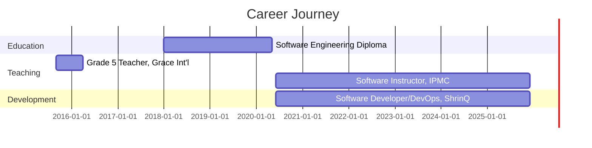

<div align="center">
  
</div>

<div align="center">

[](https://linkedin.com/in/voltrebel)
[](https://voltrebel.dev)
[](mailto:michaelkorblyjunior97@gmail.com)

</div>

---

## 👨‍💻 Professional Summary

Strategic and innovative Software Developer with 5+ years of experience in full-stack development, mobile applications, game development, and DevOps practices. Currently driving digital transformation at **ShrinQ Ghana Limited** while empowering the next generation of developers as a Software Instructor at **IPMC**, reaching over 500 students.

### 🚀 Quick Facts

```javascript
const michaelKorbly = {
    location: "Accra, Ghana 🇬🇭",
    roles: ["Software Developer", "DevOps Engineer", "Game Developer", "Instructor"],
    currentCompany: "ShrinQ Ghana Limited",
    education: ["Advanced Diploma in Software Engineering", "Degree in Computer Science"],
    studentsImpacted: "500+",
    projectsDelivered: "15+",
    yearsOfExperience: 5,
    passions: ["Building Scalable Systems", "Mobile Games", "Teaching", "Cloud Architecture"],
    currentFocus: "Enterprise Solutions & Game Development",
    availableFor: ["Freelance Projects", "Collaborations", "Consulting"]
};
```

---

## 💻 Technical Arsenal

<details open>
<summary><b>🔤 Programming Languages</b></summary>
<br>


</details>

<details open>
<summary><b>🚀 Frameworks & Libraries</b></summary>
<br>

**Backend:**


**Frontend:**


**Mobile:**


</details>

<details open>
<summary><b>🗄️ Databases & Cloud</b></summary>
<br>


</details>

<details open>
<summary><b>🛠️ DevOps & Tools</b></summary>
<br>


</details>

---

## 🎮 Game Development Portfolio

<div align="center">

### Featured Games

</div>

<table>
<tr>
<td width="50%">

#### 🏃‍♂️ Fitness Runner 3D
**Platform:** Android | **Engine:** Unity
**Year:** 2024

An endless runner game with fitness tracking integration. Players run through dynamic environments while tracking real-world fitness metrics.

**Tech Stack:** `C#` `Unity` `Android SDK` `Firebase`

**Features:**
- Real-time fitness tracking
- Procedurally generated levels
- Leaderboard system
- In-app achievements

[View Demo](#) | [Download APK](#)

</td>
<td width="50%">

#### ⚔️ Battle Arena Mobile
**Platform:** iOS/Android | **Engine:** Flutter
**Year:** 2023

Multiplayer battle arena game with real-time PvP combat. Strategic gameplay with various character classes and abilities.

**Tech Stack:** `Dart` `Flutter` `Firebase` `WebSockets`

**Features:**
- Real-time multiplayer
- 5 unique character classes
- In-game chat
- Tournament mode

[View Demo](#) | [Play Store](#)

</td>
</tr>

<tr>
<td width="50%">

#### 🧩 Brain Teaser Quest
**Platform:** Android/iOS | **Engine:** Xamarin
**Year:** 2023

Educational puzzle game with over 200 levels designed to challenge cognitive skills and problem-solving abilities.

**Tech Stack:** `C#` `Xamarin.Forms` `SQLite`

**Features:**
- 200+ challenging levels
- Daily challenges
- Progress tracking
- Offline mode

[GitHub Repo](#) | [Demo Video](#)

</td>
<td width="50%">

#### 🚗 Racing Legends
**Platform:** Android | **Engine:** Java/OpenGL
**Year:** 2022

High-speed racing game with realistic physics and multiple racing modes. Features various tracks and customizable vehicles.

**Tech Stack:** `Java` `OpenGL ES` `Android NDK`

**Features:**
- 15 racing tracks
- Vehicle customization
- Time trial mode
- Realistic physics engine

[Source Code](#) | [Gameplay](#)

</td>
</tr>
</table>

---

## 🛠️ Enterprise & Web Projects

<table>
<tr>
<td width="33%" align="center">

### 💼 Enterprise CRM
**2024**


Custom CRM solution with advanced analytics, customer management, and automation features.

**Stack:** `.NET` `React` `SQL Server` `Azure`

</td>
<td width="33%" align="center">

### 💪 Fitness Tracker
**2023**


Mobile application for comprehensive health and fitness tracking with AI-powered insights.

**Stack:** `Flutter` `Firebase` `Python` `TensorFlow`

</td>
<td width="33%" align="center">

### 🌱 Planteria
**2022**


Plant healthcare application with disease detection and care recommendations.

**Stack:** `React Native` `Python` `Computer Vision`

</td>
</tr>

<tr>
<td width="33%" align="center">

### 🏪 POS System
**2022**


Complete point-of-sale system with inventory management and sales analytics.

**Stack:** `C#` `.NET` `WPF` `MySQL`

</td>
<td width="33%" align="center">

### 📦 Inventory System
**2022**


Real-time inventory tracking with automated restocking and supplier management.

**Stack:** `Laravel` `Vue.js` `MySQL` `Redis`

</td>
<td width="33%" align="center">

### 🎓 School Management
**2021**


Comprehensive school administration platform for managing students, staff, and academics.

**Stack:** `ASP.NET` `Angular` `SQL Server`

</td>
</tr>

<tr>
<td width="33%" align="center">

### 📝 Custom Notepad
**2020**


Specialized note-taking application for TV reporter with voice-to-text and cloud sync.

**Stack:** `C#` `WPF` `Azure Cognitive`

</td>
<td width="33%" align="center">

### 📺 Nhyira Bosuo Web
**2018**


Professional website for TV show with streaming integration and audience engagement.

**Stack:** `PHP` `JavaScript` `MySQL` `Bootstrap`

</td>
<td width="33%" align="center">

### 📱 Mobile Solutions
**2023**


Various custom mobile applications for business and consumer needs.

**Stack:** `Flutter` `Kotlin` `Swift`

</td>
</tr>
</table>

---

## 💼 Professional Experience



### Current Roles

**🔹 Software Developer & DevOps Engineer**
*ShrinQ Ghana Limited* | June 2020 - Present
- Architecting and deploying scalable enterprise solutions
- Implementing CI/CD pipelines and cloud infrastructure
- Leading development teams on multiple high-impact projects
- DevOps automation reducing deployment time by 60%

**🔹 Software Instructor**
*IPMC (Intercom Programming and Manufacturing Company)* | June 2020 - Present
- Teaching 500+ students across 5 classes in software development
- Curriculum development for modern software engineering practices
- Mentoring students in debugging, testing, and software architecture
- Maintaining high standards of technical excellence and professionalism

---

## 🎯 Core Expertise

<table>
<tr>
<td width="25%" align="center">

### 🏗️ Architecture
Object-Oriented Design
Software Patterns
System Design
Microservices

</td>
<td width="25%" align="center">

### ⚙️ DevOps
CI/CD Pipelines
Cloud Infrastructure
Docker & K8s
Automation

</td>
<td width="25%" align="center">

### 📱 Mobile
Cross-Platform
Native Development
Game Development
Performance Optimization

</td>
<td width="25%" align="center">

### 👥 Leadership
Team Coordination
Project Planning
Code Reviews
Technical Mentoring

</td>
</tr>
</table>

---

## 📊 GitHub Analytics

<div align="center">

  
  

</div>

<div align="center">

  

</div>

<div align="center">

  

</div>

---

## 🎓 Education & Certifications

**🎓 Advanced Diploma in Software Engineering**
*IPMC, East Legon Accra, Ghana* | Graduated May 2020

**🎓 Degree in Computer Science**
*[University Name]* | In Progress

**📜 Relevant Certifications:**
- Cloud Computing Fundamentals
- Mobile Application Development
- DevOps Practices & Tools

---

## 🏆 Achievements & Recognition

<div align="center">

| Achievement | Year | Details |
|------------|------|---------|
| 🥇 Best IT & Science Student | 2011 | VRA Complex School, Akosombo, Ghana |
| 👨‍🏫 Trained 500+ Developers | 2020-2025 | Software Instructor at IPMC |
| 🚀 15+ Projects Delivered | 2018-2024 | Ranging from enterprise CRM to mobile games |
| 🎮 4 Mobile Games Published | 2022-2024 | Available on Android & iOS platforms |
| 💼 Enterprise Solutions | 2020-2025 | Deployed at ShrinQ Ghana Limited |

</div>

---

## 🌱 Currently Working On

- 🔹 Advanced microservices architecture for enterprise clients
- 🔹 AI-powered mobile game with machine learning capabilities
- 🔹 Open-source contributions to Flutter community
- 🔹 Building a comprehensive DevOps automation framework
- 🔹 Developing advanced curriculum for software engineering students

---

## 🤝 Open to Collaborate On

- Enterprise software solutions
- Mobile application development
- Game development projects
- Open-source initiatives
- Technical content creation
- Speaking engagements & workshops

---

## 📫 Let's Connect

<div align="center">

[](mailto:michaelkorblyjunior97@gmail.com)
[](tel:+233247049461)
[](https://linkedin.com/in/voltrebel)
[](https://voltrebel.dev)

**📍 Location:** Accra, Ghana 🇬🇭

</div>

---

<div align="center">

### 💡 "Building the future, one line of code at a time"


**⭐️ If you find my work interesting, consider starring some repositories!**

---

*Last Updated: October 2025*

</div>
